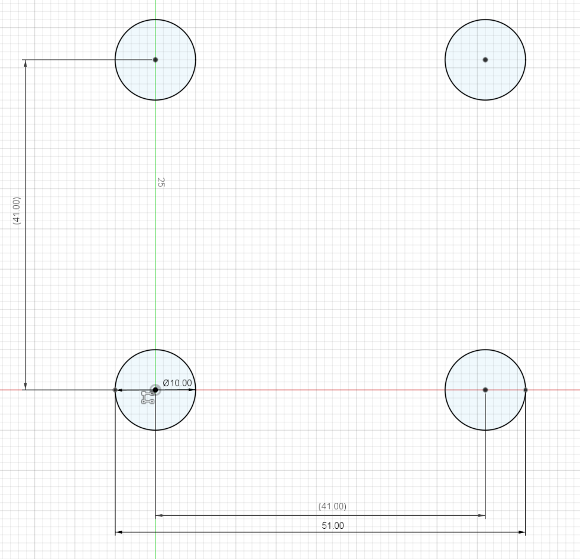
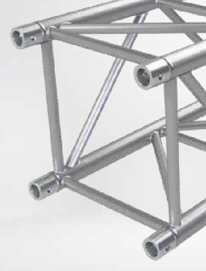
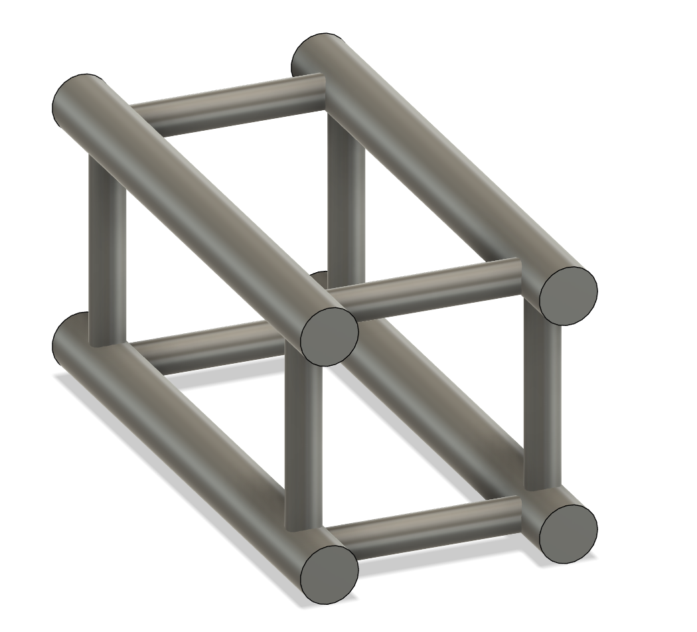
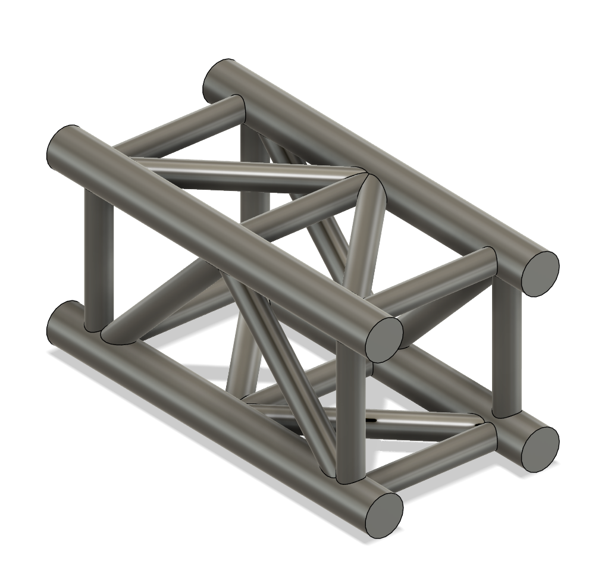
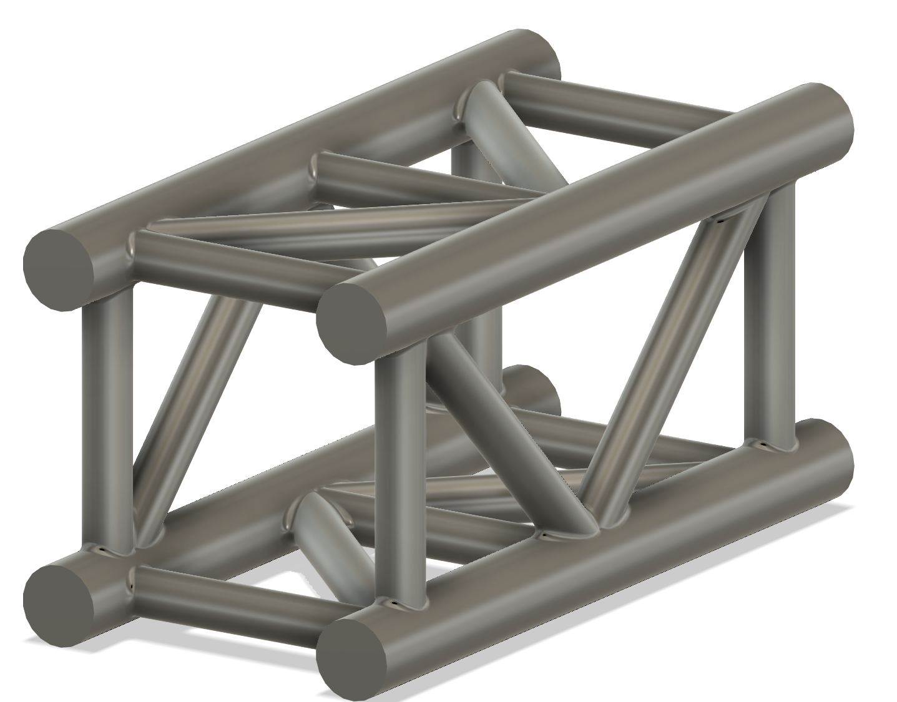
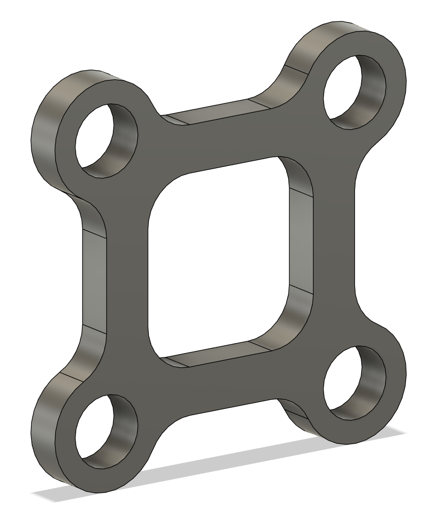
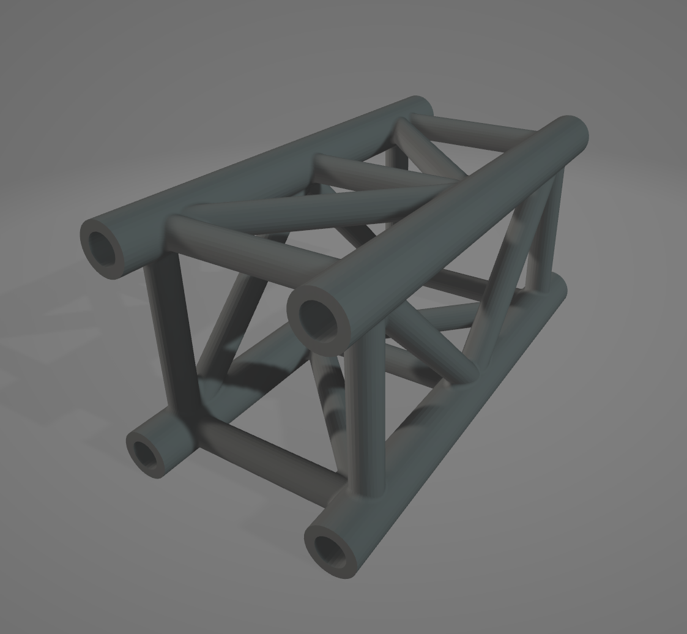

# Stagekit - Journal 1 - 13/06/2025

Alrighty!
I am pumped after just submitting my previous Highway project (Lens Board) and am super hyped to get started on this one.

Today I'm literally just going to braindump for this journal, and maybe come up with a proper idea of what I'm doing. 

I'll do a summary at the end of this journal with the general idea + diagrams, so skip to there if you don't want to hear this absolute atrocity of a writing extravaganza.

## Brainstorm

Mini stage lighting kitset kinda thing
it'll have a bunch of lights, trusses, and maybe a little fog machine run by a rpi zero 2 w.

Truss should be either buyable (aliexpress) or printable, so i'll need a solution for that

maybe straight segments buyable in one size and then just make brackets and stuff for everything else that are 3d printable

don't have a resin printer and that will probably be necessary for this, so will need to fab enough stuff through jlc3dp

actual spec-

Spi or i2c - pros and cons

nvm, spi has limitations with num devices (like max 16 slaves probs + takes a pin per slave i think) :skull:
absolutely not
i2c it is

Do they just send channel data like dmx, or do I try and establish more of a actual data connection between like rp2040's or something

Would prefer something not as expensive as rp2040
~1 usd per chip might be much?
would probs be like 5nz per fixture
hmmm
16 * 5 = 80
Would prefer closer to \$3 per fixture
we'll see

Maybe those little microcontrollers with like 8 pins

but also will need a decent number of pins for e.g moving lights

it would be good to be able to use multiple chips

but id really want to write usb from scratch

mayb i2c makes it easy? research later

Size is important, how big should stuff be?
I want a consistent scale, so maybe doing an actual to scale value would be good

Megapointe is 64 cm tall, so maybe 1:10, so 6.4 cm?
how big would a stage be at that height?

mayfair proscenium is 10.6m wide, 4.5 high, and 6m deep
at 1:10 that would be 106x45x60cm

bit big
slimpar size is 253 x 98 x 290 mm
would be 25x9.8x29

might be pushing feasibility for pcb + case + leds

dunno
seems possible??????
pcb is 1.6, light might be 5mm +- 2mm, that leaves between 1.2 and 3.2 mm wall / other size
doable

wouldn't want to go smaller, so min 1:10 scale.

cannot find any truss thingys on aliexpress, keep looking later but maybe all 3dp

makes it easier tbh

if its 1:10 scale, how thick are mounting things on eurotruss?

Eurotruss ST is 30mm rad
would be 3mm
so 6mm diam
could be fine? - check resin print tolerances

its fine

inter big one things might need to be thicker tho, but thats fine

Clamps?

Maybe just have hooks on the lights, doesn't really need to be detachable or anything, they're mostly going to be hung the same way

going to sleep now, will cont. morgens

Es ist morgens jetzt

Ok, continueing

clips can just be 3d printed attached to the lights probs, maybe rotateable but i can't imagine it really mattering unless you want to put it in some wacky orientation

I want to have a moving light, but motors will be hard
will see, maybe those mini servo things or stepper + encoder

Anyway, list of what I want, to scale obv

- 15m straight truss
- 5m straight truss
- 2.5m straight truss
- 1m straight truss
- Truss corner 90
- truss corner 45
- truss junction 8 way
- truss junction 4 way
- truss t junction
- truss junction 3 way 
- rgbw par (sim to slimpar pro h usb?)
- rgbw tube (single - 8 pixel, not sure how many)
- moving head (megapointe size, bc smaller might be unrealistic)
- smoke machine (ultrasonic vaporizer maybe? don't know how water based is for electronics lol - pause, i can just tear down a vape :skull:)

Alright, that seems like a reasonable scope.

In terms of control, I would definitely like art net, maybe dmx input, but idk how that would work on pi.

Each light will need data + power.

Want super small cables, too thick and they'll look ugly as hell.
Could make my own with enamel copper wire + heatshrink, but would need connectors still.

Connectors probs molex, but maybe..

hold up
could use 4 pole headphone cables?
maybe too much depth required

probs JST-SH or picoblade

## The Idea (refined)

The main concept for this project is a mini kitset stage, complete with working lights and a fogger, for use as a decorative piece or for lighting previs.

The system uses a mostly consistent 1:10 scale, as shown in the image below.

The object shown is the standard *Eurotruss* size, which is normally 510x510mm, but in my scale model, is 51x51mm. 

This size was chosen due to its resulting sizes of the beams, which are in the scale model, a diamter of 6mm, which is within the capabilities of a resin 3d printer, which is the intended fabrication method for the set.

The Stagekit system will use an array of truss shapes, which can all be connected together to form a stage, as well as several varieties of lights which can be clipped onto the trusses and powered to be controlled either automatically or from art net, driven by a Raspberry Pi Zero 2 W or similar.

Each light will communicate over I2C delivered through molex cables, and have either an STM32C011F6 or ATTiny804 chip which will control and potentially drive the LED's, motors, or other hardware.

In its current form, Stagekit will consist of the following elements:
- Variety of truss elements
- Various set dressing elements
- RGBW LED Par
- RGBW LED Tube
- RGBW LED Moving Head
- Micro Haze / Fog Machine
- Control Module

## Start of design

I've decided to begin by modelling the basic truss, so time to fusion 360 for a few hours.

I'm actually going to go with slightly different than the official eurotruss spec, going with a 10mm main tube diameter rather than 5mm, just to add additional support, while keeping the overall 51x51mm profile


Likewise, for the braces, I am going to go with a 6mm diameter rather than 3mm, so as to make it more printable and also look a bit better. 

Each truss has a 7.5mm 'clear zone' at each end, for connecting brackets later, similar to the official eurotruss, but in my case, there are probably going to be 3d printed sleeves rather than bolts.





Adding in the support beams, 



And the 1m truss section is mostly done :)
I'm also going to add a slight chamfer on all of the corners, just to make it look a bit prettier and add some more structural support when printing.



And thats the first truss piece complete. This is the 1m (10cm) straight piece, and I have a couple more variants of this I'll make tonight.

```
*Note*
I quoted this on jlcpcb using sls resin (the cheapest possible option)
and its currently sitting at $3.91 a piece, which is pricy, so I might 
have to compromise on scale and go to around 1:20, which should roughly 
halve the price, but might introduce issues with keeping a consistent 
scale between lights and the truss, as moving heads will be difficult
when they're only 32mm tall :(
```

**Alright quick sidetrack**

What if I used carbon fiber rods (or similar) for the main truss chords instead?

I can get 500mm of OD:9mm ID:6mm Aluminum tubing for \$1.98 on aliexpress.

100mm straight truss would cost \$1.58 for the four main chords.

I quickly designed this bracket, 3 of which would be needed per section of truss.



These would cost \$0.41 each, so \$1.23 per section of truss.

This results in a final cost of \$2.81 for a 100mm section, which is significant improvement, however, I'm not sold on the look of these trusses, as they're missing the crossbeams which I so dearly love :(

**Sidetrack number 2**

What if I just hollow out the truss segments, 10mm is more than thick enough to print, I could probably make it a tube with an OD of 10mm, and ID:5-7.5mm.

Alright, I've made two versions of this to test and the results are promising.

Version 1.
- OD: 10mm
- ID: 6mm
- Price: \$3.04
---
Version 2.
- OD: 10mm
- ID: 7.5mm
- Price: \$2.54

I'm not massively comfortable with version two due to the thickness of the walls, so that might be a no go.



**Sidetrack number 3**

What about me just fdm printing myself at home?
I'm really bad at printing multiple things, and my bed is super rough to print on (adhesion is so bad I need tape to get it to stick at all) but it will likely be way cheaper than sls or ordering online (jlc3dp charges $5 for the hollowed version fdm).

Chucking it into cura, it's approximately 50g of filament used, with a 9 hour print time on my printer.

Looking at Jaycar, 1kg of ABS filament costs \$21.57 (which is admittedly pricy but it also has no shipping costs, so this could be roughly average? I'll check aliexpress later). This would mean a cost of approx \$1 per 100mm segment, but power costs are also real, and this would be around 150w per hour, or for a 7.5 hour print, 1.13kW. At the rates where I live, this is around an extra $0.20 per segment. 

In total, \$1.20 per segment

```
*Note*
My model is currently not the most efficient, when standing vertical, most 
of the cross beams don't need support because they are at 45 degree angles,
but there are two cross beams that are horizontal, and thus need supports
I think if I took these out (they're not important for structural integrity,
i'm not needing to actually match the eurotruss spec) i could probably save
around 5g and an hour or so of print time.
```

## Wrap up

Overall, the most efficient manufacturing method is looking to be fdm printing myself :(

\$1.20 per 100mm segment I think is a reasonable cost, and I'll probably have around 10-15 in the final kit, as these will likely be the most used parts.

I think todays been a big success, I've not only got the full idea down, but designed one of the essential pieces, figured out some manufacturing stuff and also gotten a reasonable grasp on what to do next.

Looking forward to continueing tomorrow :heart:

**Time Spent: 6 Hours**