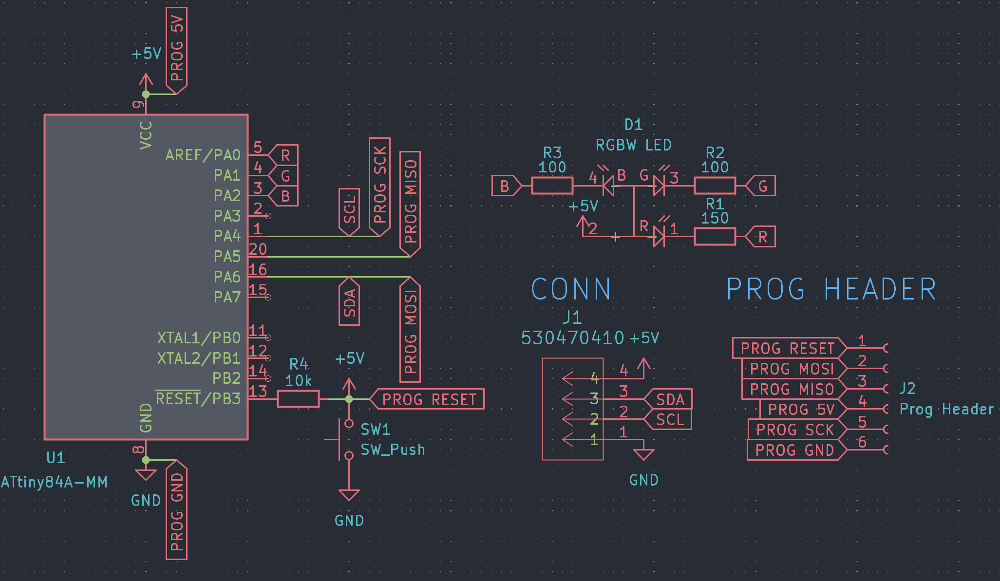

# Stagekit - Journal 1 - 13/06/2025

Alrighty!
I am pumped after just submitting my previous Highway project (Lens Board) and am super hyped to get started on this one.

Today I'm literally just going to braindump for this journal, and maybe come up with a proper idea of what I'm doing. 

I'll do a summary at the end of this journal with the general idea + diagrams, so skip to there if you don't want to hear this absolute atrocity of a writing extravaganza.

## Brainstorm

Mini stage lighting kitset kinda thing
it'll have a bunch of lights, trusses, and maybe a little fog machine run by a rpi zero 2 w.

Truss should be either buyable (aliexpress) or printable, so i'll need a solution for that

maybe straight segments buyable in one size and then just make brackets and stuff for everything else that are 3d printable

don't have a resin printer and that will probably be necessary for this, so will need to fab enough stuff through jlc3dp

actual spec-

Spi or i2c - pros and cons

nvm, spi has limitations with num devices (like max 16 slaves probs + takes a pin per slave i think) :skull:
absolutely not
i2c it is

Do they just send channel data like dmx, or do I try and establish more of a actual data connection between like rp2040's or something

Would prefer something not as expensive as rp2040
~1 usd per chip might be much?
would probs be like 5nz per fixture
hmmm
16 * 5 = 80
Would prefer closer to \$3 per fixture
we'll see

Maybe those little microcontrollers with like 8 pins

but also will need a decent number of pins for e.g moving lights

it would be good to be able to use multiple chips

but id really want to write usb from scratch

mayb i2c makes it easy? research later

Size is important, how big should stuff be?
I want a consistent scale, so maybe doing an actual to scale value would be good

Megapointe is 64 cm tall, so maybe 1:10, so 6.4 cm?
how big would a stage be at that height?

mayfair proscenium is 10.6m wide, 4.5 high, and 6m deep
at 1:10 that would be 106x45x60cm

bit big
slimpar size is 253 x 98 x 290 mm
would be 25x9.8x29

might be pushing feasibility for pcb + case + leds

dunno
seems possible??????
pcb is 1.6, light might be 5mm +- 2mm, that leaves between 1.2 and 3.2 mm wall / other size
doable

wouldn't want to go smaller, so min 1:10 scale.

cannot find any truss thingys on aliexpress, keep looking later but maybe all 3dp

makes it easier tbh

if its 1:10 scale, how thick are mounting things on eurotruss?

Eurotruss ST is 30mm rad
would be 3mm
so 6mm diam
could be fine? - check resin print tolerances

its fine

inter big one things might need to be thicker tho, but thats fine

Clamps?

Maybe just have hooks on the lights, doesn't really need to be detachable or anything, they're mostly going to be hung the same way

going to sleep now, will cont. morgens

Es ist morgens jetzt

Ok, continueing

clips can just be 3d printed attached to the lights probs, maybe rotateable but i can't imagine it really mattering unless you want to put it in some wacky orientation

I want to have a moving light, but motors will be hard
will see, maybe those mini servo things or stepper + encoder

Anyway, list of what I want, to scale obv

- 15m straight truss
- 5m straight truss
- 2.5m straight truss
- 1m straight truss
- Truss corner 90
- truss corner 45
- truss junction 8 way
- truss junction 4 way
- truss t junction
- truss junction 3 way 
- rgbw par (sim to slimpar pro h usb?)
- rgbw tube (single - 8 pixel, not sure how many)
- moving head (megapointe size, bc smaller might be unrealistic)
- smoke machine (ultrasonic vaporizer maybe? don't know how water based is for electronics lol - pause, i can just tear down a vape :skull:)

Alright, that seems like a reasonable scope.

In terms of control, I would definitely like art net, maybe dmx input, but idk how that would work on pi.

Each light will need data + power.

Want super small cables, too thick and they'll look ugly as hell.
Could make my own with enamel copper wire + heatshrink, but would need connectors still.

Connectors probs molex, but maybe..

hold up
could use 4 pole headphone cables?
maybe too much depth required

probs JST-SH or picoblade

## The Idea (refined)

The main concept for this project is a mini kitset stage, complete with working lights and a fogger, for use as a decorative piece or for lighting previs.

The system uses a mostly consistent 1:10 scale, as shown in the image below.


The object shown is the standard *Eurotruss* size, which is normally 510x510mm, but in my scale model, is 51x51mm. 

This size was chosen due to its resulting sizes of the beams, which are in the scale model, a diamter of 6mm, which is within the capabilities of a resin 3d printer, which is the intended fabrication method for the set.

The Stagekit system will use an array of truss shapes, which can all be connected together to form a stage, as well as several varieties of lights which can be clipped onto the trusses and powered to be controlled either automatically or from art net, driven by a Raspberry Pi Zero 2 W or similar.

Each light will communicate over I2C delivered through molex cables, and have either an STM32C011F6 or ATTiny804 chip which will control and potentially drive the LED's, motors, or other hardware.

In its current form, Stagekit will consist of the following elements:
- Variety of truss elements
- Various set dressing elements
- RGBW LED Par
- RGBW LED Tube
- RGBW LED Moving Head
- Micro Haze / Fog Machine
- Control Module

## Start of design

I've decided to begin by modelling the basic truss, so time to fusion 360 for a few hours.

I'm actually going to go with slightly different than the official eurotruss spec, going with a 10mm main tube diameter rather than 5mm, just to add additional support, while keeping the overall 51x51mm profile


Likewise, for the braces, I am going to go with a 6mm diameter rather than 3mm, so as to make it more printable and also look a bit better. 

Each truss has a 7.5mm 'clear zone' at each end, for connecting brackets later, similar to the official eurotruss, but in my case, there are probably going to be 3d printed sleeves rather than bolts.


Adding in the support beams, 


And the 1m truss section is mostly done :)
I'm also going to add a slight chamfer on all of the corners, just to make it look a bit prettier and add some more structural support when printing.


And thats the first truss piece complete. This is the 1m (10cm) straight piece, and I have a couple more variants of this I'll make tonight.

```
*Note*
I quoted this on jlcpcb using sls resin (the cheapest possible option)
and its currently sitting at $3.91 a piece, which is pricy, so I might 
have to compromise on scale and go to around 1:20, which should roughly 
halve the price, but might introduce issues with keeping a consistent 
scale between lights and the truss, as moving heads will be difficult
when they're only 32mm tall :(
```

**Alright quick sidetrack**

What if I used carbon fiber rods (or similar) for the main truss chords instead?

I can get 500mm of OD:9mm ID:6mm Aluminum tubing for \$1.98 on aliexpress.

100mm straight truss would cost \$1.58 for the four main chords.

I quickly designed this bracket, 3 of which would be needed per section of truss.


These would cost \$0.41 each, so \$1.23 per section of truss.

This results in a final cost of \$2.81 for a 100mm section, which is significant improvement, however, I'm not sold on the look of these trusses, as they're missing the crossbeams which I so dearly love :(

**Sidetrack number 2**

What if I just hollow out the truss segments, 10mm is more than thick enough to print, I could probably make it a tube with an OD of 10mm, and ID:5-7.5mm.

Alright, I've made two versions of this to test and the results are promising.

Version 1.
- OD: 10mm
- ID: 6mm
- Price: \$3.04
---
Version 2.
- OD: 10mm
- ID: 7.5mm
- Price: \$2.54

I'm not massively comfortable with version two due to the thickness of the walls, so that might be a no go.


**Sidetrack number 3**

What about me just fdm printing myself at home?
I'm really bad at printing multiple things, and my bed is super rough to print on (adhesion is so bad I need tape to get it to stick at all) but it will likely be way cheaper than sls or ordering online (jlc3dp charges $5 for the hollowed version fdm).

Chucking it into cura, it's approximately 50g of filament used, with a 9 hour print time on my printer.

Looking at Jaycar, 1kg of ABS filament costs \$21.57 (which is admittedly pricy but it also has no shipping costs, so this could be roughly average? I'll check aliexpress later). This would mean a cost of approx \$1 per 100mm segment, but power costs are also real, and this would be around 150w per hour, or for a 7.5 hour print, 1.13kW. At the rates where I live, this is around an extra $0.20 per segment. 

In total, \$1.20 per segment

```
*Note*
My model is currently not the most efficient, when standing vertical, most 
of the cross beams don't need support because they are at 45 degree angles,
but there are two cross beams that are horizontal, and thus need supports
I think if I took these out (they're not important for structural integrity,
i'm not needing to actually match the eurotruss spec) i could probably save
around 5g and an hour or so of print time.
```

## Wrap up

Overall, the most efficient manufacturing method is looking to be fdm printing myself :(

\$1.20 per 100mm segment I think is a reasonable cost, and I'll probably have around 10-15 in the final kit, as these will likely be the most used parts.

I think todays been a big success, I've not only got the full idea down, but designed one of the essential pieces, figured out some manufacturing stuff and also gotten a reasonable grasp on what to do next.

Looking forward to continueing tomorrow :heart:

**Time Spent: 6 Hours**


# Stagekit - Journal 2 - 15/06/2025

Today was not a fun day :(

I spent around 6 hours tuning my 3d printer, trying to get even somewhat decent bed adhesion without requiring masking tape.

Unfortunately, in this I failed, I eventually gave up and went back to tape, but I did manage to get the printer going 3ish times faster, which is a major bonus. 

I managed to run it at around 140mm/s compared to the normal 50-60mm/s for the Ender 3 v2, which isn't actually bad.

I also did some general maintanence: cleaning, adjusting belt tension, adjusting eccentric nuts, cleaning the bed; I even started to get klipper set up with one of my rpis from high seas :)

Overall, not amazing, but not terrible either. 
This was absolutely necessary given the amount of printing I'm going to be doing, every hour counts.

Afterwards, I worked on designing the next truss piece, a basic corner.
This was hell.
I got the basic design down pretty quickly, but soon realized that my current idea of just having sleeves that connected between the trusses wasn't going to work. The corner would have to be larger than 51x51mm, making an unevenly offset system. 


At the moment, I've just gone with this, but I may be able to fix this later, if not, I can just make some special adaptor segments to bridge gaps.

---

*Interesting thing: the braces on the corner form a tetrahedron:*


---

Anyways, thats me for tonight, I need sleep :sob:

# Stagekit - Journal 3 - 16/06/2025

First things first, I made the schematic for the RGB Par (only rgb now, because I can't find any rgbw on jlcpcb for cheap).

This wasn't too bad, but it took a while to settle on a specific MCU, I was torn between the ATTiny804 or the ATTiny84, but eventually went with the ATTiny84a, as this is the mcu for which the I2C slave library was originally tested on, so it has a lot more examples and will overall cause me a lot less headaches.

I was originally really concerned when parts hunting, because the actual chip costs more than an rp2040, ($1.74 vs ~$1), but I quickly remembered that this actually includes an internal clock and flash memory, so is overall cheaper.

Once the MCU was sorted, I went onto the programming, which is not as easy as for the rp2040.
Normally, on the rp2040, I just connected the usb port and hit upload, but for the attiny, you need to use an isp programmer.

I'm just going to buy one of these seperately, but because I'm using the smd version of the chip, I can't just use the dip programmer. Instead, I've exposed a programming header, which isn't actually going to have a header mounted, so that I can connect it to program, and then seal up the case and not have ugly pins sticking out. It just uses spi, which wasn't too hard to wire up, but I am very much more used to i2c, so not as easy as usual (I keep on mixing up MISO and MOSI).

For the actual LED, there unfortunately was not an easily accessible parts library online, so I quickly made my own symbol and footprint; Fingers crossed that it works fine.

Anyways, here is the finished schematic, I'm going to work on the pcb for around another hour, and I'll report back here where I get to.



PCB Routing progress has been made! 
I layed out all of the components (after realizing that I also needed another connector for passthrough, which I quickly added).


Then just some quick and dirty routing.


And boom, pcb done! I got a quote from jlcpcb, and in total, for a run of 5, its \$26.69, so ~\$5.34 a piece. This isn't terrible, but I have a feeling I could do a lot better if I hand assemble it, so I'm now going to try and redo the pcb with pure dip footprints, and I'll see if it's feasible to do it that way cost wise.

For this, I'm going to change the MCU, again, this time to an attiny85, given I can get them for a lot cheaper in dip format and I do know how to get them to work :)

Alright, I've redone the schematic, and as you can see, it's slightly simplified.


This is because I've opted to exclude the programming header from the board. If I'm buying the parts and then putting them on the board, I can easily just use the programmer in the way it was intended, just slotting in the chip and then soldering it after it's already programmed.

Time to build up the pcb and then do the bom. 

```
*Side Note*
I've already got a bunch of rgb leds leftover from a previous project, so I've redone the schematic and footprint to use those instead, I'll try and find the source I purchased them from originally for anyone building this later :)
```


My god this was painful to all fit on. I've put all the resistors on the back side, and the chip and led on front, but I might move the chip to the back side as well later, just to help with even light, but I think it won't be too much of an issue to bother.

I had to add some margin of error on the led, as I'm unsure of the exact dimensions, even while I can measure them, I'm not particularly confident in my measuring skills, so I added a bit of a margin just in case.


Routing it was almost even more painful than placing the components, but it's done now, looks clean enough, and hopefully will be a bit cheaper.

Speaking of, its cost breakdown time!

| Item  | Cost  |
| ----- | ----- |
| PCB   | $0.42 |
| MCU   | $1.76 |
| R's   | $0.24 |
| Molex | $0.50 |
| LED   | $0.24 |
| Misc  | $0.30 |
| ----- | ----- |
| Total | $3.46 |

That's not bad :)

Misc costs include e.g solder, shipping (accounting for batch ordering) and random wears and tear.

That concludes my work for today, I'm going to 3d print a little test which I'll talk about tomorrow, but for now, goodnight!

# Stagekit - Journal 4 - 17/06/2025

'Ello poppets!

Today I've been working on the case for the rgb par so far, and have got what I would consider a mostly finished model, but first, the afforementioned 3d print.

The 3d print I made yesterday was a little test for a mechanism to add a bit of diffusion paper to the light.

For those unaware, a diffuser helps with spreading the light out a bit more:


This should make it look a bit less like a single led and more like light is coming flatly from the entire front surface, but I don't have too high hopes lol.

For the actual mechanism to hold the diffusion paper, its a simple press fit ring that clamps down on the paper, pulling it taut and keeping it secure. This hopefully will also hold the entire assembly together with only a press fit, which should make it easily maintainable.


Onto the actual case for the light I guess.

### The bottom case


I designed this so that the pcb can just sit on the little thingymabobs and it will be the right height so that the ports on the bottom fit well. Hopefully it won't fall out, because there are no screws or anything holding it down, but the fit is tight enough it should be fine.


I also decided to add some decorative little heatsink thingys, just because I see them on a ton of lights and they add some visual interest to otherwise a plain cylinder.


### The top case


The top case is again the same mechanism as the 3d printed one earlier, just a simple hoopish structure that is a press fit over the top of the bottom case.

Not really too much to say here, its got a little lip to hold the paper more taut, but nothing too interesting.


### The clamp

I'm pretty happy with the clamp.


Its based around the 10mm cylinder that is the main chords of the trusses, but it also has some little lips so it won't fall out and should satisfyingly clip onto the trusses.


Overall, I think the case turned out looking pretty decent. The clamp part looks a bit ugly, but that can't really be helped without more resources than I'm willing to spare.

The dimensions of the light do differ from the real equivalent slightly, ending up having a dimension of 36x36x13.5 (excluding the hook), which is a bit larger than the desired 25x25x10, but should be close enough to scale to look good.

That's me for today, I'm taking a slight break for the rest of tonight because I'm hellishly tired and have homework to do, but tomorrow my goal is to make one more truss piece and design the schematic and pcb for the rgb tube.


```
*Note*
Just quoted the parts on jlcpcb, $0.66 for all the 3d printing
for one with standard resin.
```

# Stagekit - Journal 5 - 18/06/2025

The pixel tube I'm trying to model mine off of is the Astera Helios Tube, but its dimensions are frankly a bit much to do at 1:10 scale.

They have a diameter of 42mm, which would be 4mm at scale, which is very much too hard to do. Because of this, I'm scaling it to Ø8mm x 103mm.


### The schematic

The schematic is pretty similar to the par, but instead of an rgb led, it has six neopixels, just to save on mcu pins. This means I still could use the attiny85a, which is nice as I could reuse like 90% of the previous schematic.


Overall, the schematic took like 30 seconds lol.

### The PCB

The pcb was around the same, but I had difficulty decided the length of the light overall. I wasn't sure if I wanted it ~1m or ~2m long, but I eventually settled on around 1.6m (~150mm). 


### The Case
This was much harder than the previous design, as I had to settle on how I was going to diffuse the light, but after considering acrylic tube with diffusion paper, silicon tubing, and pmma, I decided on pmma tube.

PMMA is a form of acrylic but is much more often available as a frosted translucent material, which is perfect for what I need. 

I eventually came up with yet another design consisting only of press fits (hopefully this doesn't come back to bite me) and voila, case done. 


Sorry if this journal was a bit lackluster, I'm writing this a couple days later and I'm still feeling pretty sick.

# Stagekit - Journal 6 - 19/06/2025

Today was focussed on updating boms, and making the blinder

Guess what day it is!

Thursday, but thats besides the point.
Today is BOM day!

I'm going to go through the lights I've done so far and make up some nice boms for them so I don't have to do them all in one chunk at the end. 

Starting off with the rgb par, I tried to arrange it so that all the parts came from aliexpress, but unfortunately I couldn't find any of the molex connectors I need (i am finding a lot of the jst sh line... oops), so I've decided to go with lcsc for them. 
However, I've come to an overall price of \$3.025 (excl shipping), so thats something.

For the rgb tube, its a similar story, everything possible from aliexpress except the molex connectors again, and it came out to a unit cost of \$4.015 (excl shipping), which is actually excellent.

### The blinder

Blinders are very cool lights. They blind, look cool, and yeah...
Blind stuff cool!

I basically copied the schematic from the rgb tube, just using two neopixels instead of six, so that was super easy. 


The pcb was also super chill with routing and layout, just was a bit of a squeeze fitting the attiny.


For the case, I did another press fit, and just made a two part case which the pcb slots into (hopefully tight enough it doesn't bounce around), and added some holes on top for light and then the clamp.


 

 


Again there will be a little bit of diffusion paper that slots between the top and bottom case, so it won't look as ugly in the final light.

Following finishing this, I quickly made a bom for it as well, coming in at \$2.985, which is not bad at all.

Thats me for today, tomorrow i'm working on finishing up my keyboard for submission, so I'll probably do more on sunday.

# Stagekit - Journal 7 - 22/06/2025

Today I'm going to be working on the start of the first moving light, and for this (maybe stupidly) I'm going to try and tackle a two axis light (pan and tilt), so we'll see how that goes.

After much deliberation (and I mean much, I spent like 6 hours researching), I've come to the conclusion that it is practically impossible to make this light to scale while including hardware like motor drivers, the actual control chip, and the motors themselves.

As I see it, there are a couple possible solutions:
**A.**
Have the driving and control hardware in the seperate enclosure somewhere else (maybe behind or underneath the stage)
**B.**
Have the motors not actually move
**C.**
Have my light at double or triple the scale of the actual lights.

I don't really want a static moving light, so option B is out of the question. 

For option C, I'll just let you look at the following diagram:


Yeah, this might not be a great option either...

With option A, the base and yoke can be as small as I can get the motors, and the actual head can be tiny, so there are much less problems with scale.

In that case:
### Motor selection

I spent several hours hunting through different types of motors, and I've come to a conclusion, they're all too big :(


However, I'm willing to compromise and go with one of the n20 motors, as they're still a decently ok size.

For actually turning the yoke (the U-shaped part f the light) I obviously can't have a different direction for the motor, so I'll need some form of gearing.

First of all, with the n20 right angle:

I would prefer to not have the yoke directly attached to the motor, as then the base gets very wide, so what I'm thinking is gears, essentially something like this:


For the n20 flat, I was considering something akin to how the microwave plates work, where they spin around on rollers and stuff.

Basically this:


Tbh, the first one will probably work better, so i'll go with that one.

Unfortunately, its getting late, so I'm going to continue on with this tomorrow.

**Time Spent: 6 Hours**